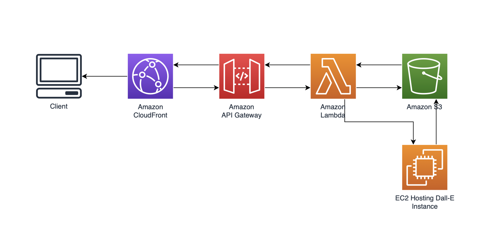

# TextToImage Generator

TextToImage Generator is a simple image generator built using Stable Diffusion and Diffusers

## Problem Statement

I’m the webmaster of a retail site called XXX where 3rd-party merchants can sell their products. I’d really like more merchants to sign up to sell their products, but through my own research I’ve found that some of them are hesitant to sign up because they can’t visualize what their product will look like on our site. It’s a big investment for them to take a photo, upload it, and write up a description, so I’d really like to find a way to do this for them somehow. I’ve seen that there are projects like DALL-E, Stable Diffusion, and other generative ML models that can generate pictures so I think it might be possible. Can you help me?

## Features

- Generate image based on text typed on terminal
- Uploads generated image onto S3 bucket and local device

## Tech

TextToImage uses the following open source projects to work properly:

- [Diffusers](https://github.com/huggingface/diffusers) - provides pretrained diffusion models across multiple modalities, such as vision and audio, and serves as a modular toolbox for inference and training of diffusion models.
- [Stable Diffusion](https://github.com/CompVis/stable-diffusion) - is a latent text-to-image diffusion model

## Installation

Recommended to use a virtual environment
```sh
$ virtualenv env
$ source env/bin/activate
(<env_name>)$ pip install requirements.txt
```

## Configurations

To use the upload to S3 feature, please uncomment lines 34, 39, and 40 and input bucket name. (Note: Bucket should have generatedImages/ folder)
```
#bucketName = ""
    #    s3 = boto3.resource('s3')
    #    s3.meta.client.upload_file(folderName + "/" + imgString + ".png", bucketName, imgString + ".png")
```

Additionally, please ensure the AWS CLI has [programmatic access](https://docs.aws.amazon.com/IAM/latest/UserGuide/id_users_create.html) and S3 has the proper [permissions](https://docs.aws.amazon.com/AmazonS3/latest/userguide/using-with-s3-actions.html).

## Running
```sh
python textToImage.py
```
At some point, you will receive a prompt to input [Hugging Face Access token](https://huggingface.co/docs/hub/security-tokens). (Note: A Hugging Face account must be made and create a Hugging Face Access token)

## System Design (For full implementation)

